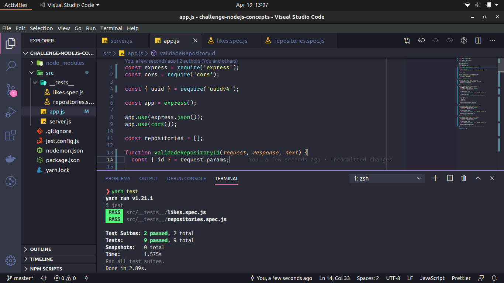
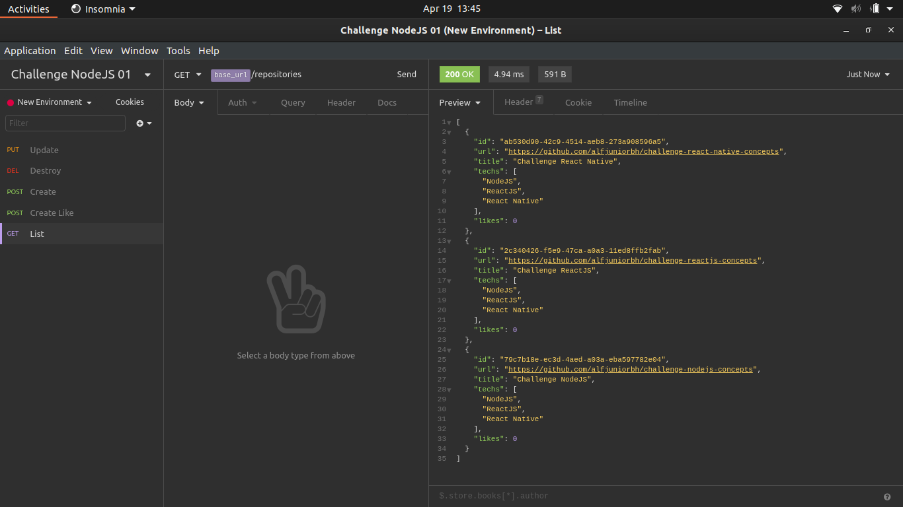

<h3 align="center">
  NodeJS Concepts Challenge
</h3>

## :rocket: About the challenge

During this project the concepts were applied with the implementation of a simple CRUD using NodeJS, Express with return in JSON in order to serve the front-end in ReactJS and the Mobile application in ReactJS.

The tests were properly run and passed, so it was respected and followed as requested by the task.

Below is a preview of how the application looks.

